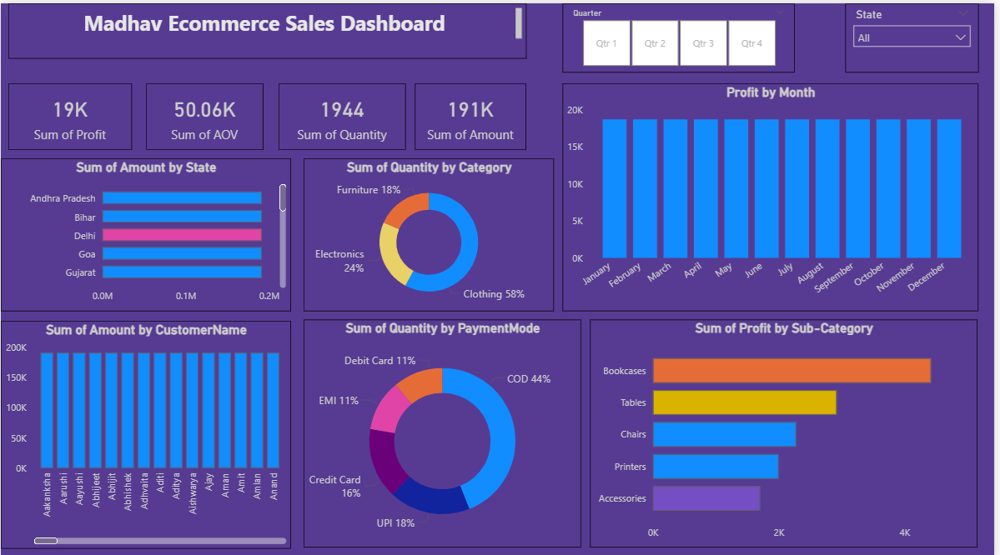

# E-Commerce Sales Analysis Dashboard | Power BI

## Project Overview
This project focuses on analyzing e-commerce sales data using Power BI.
The objective was to understand sales performance, customer behavior,
profit trends, and category-wise insights through an interactive dashboard.

## Dataset Description
The dataset contains information related to:
- Order ID
- Customer details
- Product categories
- Sales
- Profit
- Quantity
- Order date

## Key Analysis & Insights
- Identified top-performing product categories
- Analyzed monthly and yearly sales trends
- Compared profit vs sales performance
- Observed customer purchasing behavior
- Region-wise sales analysis

## Dashboard Features
- Interactive slicers (Year, Category, Region)
- KPI cards for Sales, Profit, Orders
- Bar charts, line charts, etc
- Trend analysis visuals
- Clean and user-friendly layout

## Tools & Technologies Used
- Power BI
- Power Query
- DAX
- Python (for initial data cleaning)

## Dashboard Overview

